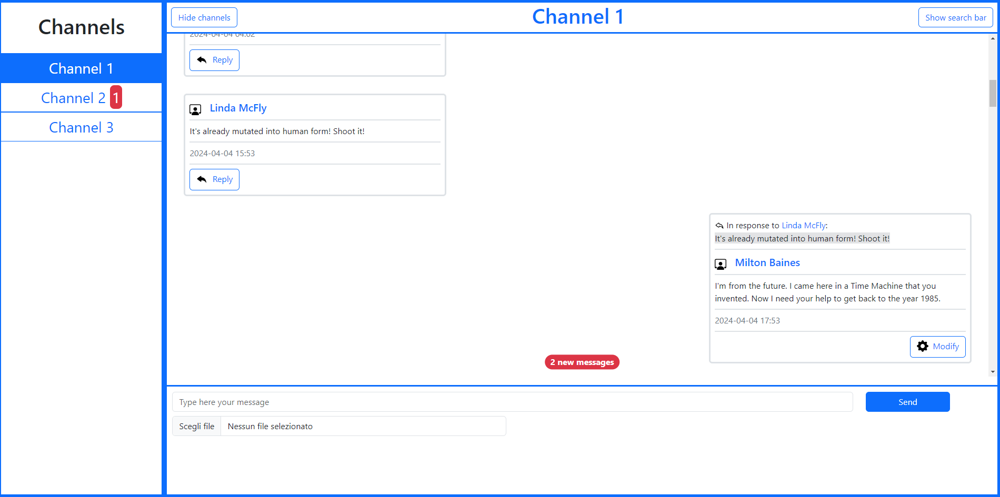

# Web Chat

This project is a reusable Angular component designed for displaying and interacting with a chat interface. Developed as part of the "Web Applications 2" module, the component is equipped with a comprehensive set of features to manage chat channels, messages, and real-time communication. This component integrates seamlessly with a provided backend, supporting functionalities typical of modern chat applications.

## Key Features

- **Channel List Management**:
A sidebar menu displays a list of available channels.
If only one channel is "visible," the sidebar automatically hides, focusing the view on the active channel.

- **Channel View Toggle**:
Allows users to manage and toggle the visibility of channels. Only one channel can be displayed at a time to keep the interface clean and user-friendly.

- **Message List Display**:
The component supports displaying a list of messages for the currently selected channel, offering a clear and organized view of the conversation.

- **Create New Message**:
Users can compose and send new messages within the current channel.
Optional file attachments can be added to messages for enhanced communication.

- **Message Editing**:
Messages can be edited after being sent.
Edited messages are clearly marked in the frontend to indicate that modifications have been made.

- **Reply to Messages**:
Users can reply to existing messages, with replies being visually distinct to differentiate them from original messages.

- **Link Preview in Messages**:
If a message contains a link, the component automatically generates and displays a preview of the linked content directly below the message.

- **Message Search**:
Allows users to search for messages within a channel based on content and author, making it easy to find specific information.

- **Real-Time Message Updates**:
The component supports real-time updates for new messages received in a channel via WebSocket.
A toast notification alerts users to new messages.
If the new messages are in a channel that is not currently active, a badge with the number of unread messages is displayed next to the channel name.

- **Backend Integration**:
The component is designed to work with the provided backend, ensuring seamless data handling and message management.

## Technologies Used

- Angular
- TypeScript
- WebSocket